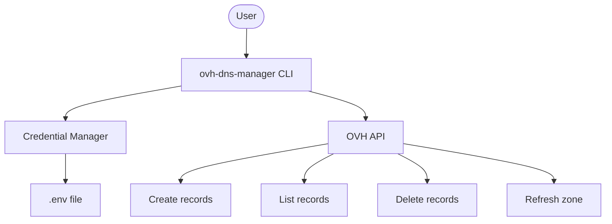

# OVH DNS Manager CLI


A CLI tool for managing DNS entries on domains hosted at OVH, built with [Rich](https://github.com/Textualize/rich) for a beautiful interactive terminal experience.



## 🚀 Features

| Feature | Description |
|---------|-------------|
| 🖥️ Interactive interface | User-friendly prompts and menus, no complex CLI arguments needed |
| 🔐 Secure credentials | OVH API keys stored in `.env` with restricted file permissions |
| 📦 Bulk creation | Create multiple subdomains at once for any record type |
| 🌐 Multi-type DNS | Support for A, AAAA, CNAME, TXT, MX and SRV records |
| 🔄 Auto-refresh | Automatic DNS zone refresh after changes |
| ♻️ Retry logic | Exponential backoff on transient network errors |

## 📋 Prerequisites

* Python 3.10 or higher
* An active OVH account with access to the domain you wish to manage

## 🛠️ Installation

### Via [uv](https://docs.astral.sh/uv/) (recommended)

```bash
uv tool install git+https://github.com/SnappFr/ovh-dns-manager.git
```

### Via pipx

```bash
pipx install git+https://github.com/SnappFr/ovh-dns-manager.git
```

### From source

```bash
git clone https://github.com/SnappFr/ovh-dns-manager.git
cd ovh-dns-manager
uv venv && source .venv/bin/activate
uv pip install -e .
```

---

## 🔑 Configuration (OVH API Credentials)

### Step 1: Generate API tokens

1. Visit the [OVH Create Token page](https://api.ovh.com/createToken/)
2. Log in with your OVH ID
3. Fill in the form:
   * **Script name:** `OVH DNS Manager` (or your preference)
   * **Description:** CLI for DNS management
   * **Validity:** `Unlimited` (recommended for local scripts)
   * **Rights:**

   | Method | Path |
   |--------|------|
   | `GET` | `/domain/zone/*` |
   | `POST` | `/domain/zone/*` |
   | `PUT` | `/domain/zone/*` |
   | `DELETE` | `/domain/zone/*` |

4. Click **Create keys**
5. You will receive three values: **Application Key**, **Application Secret**, and **Consumer Key**

### Step 2: Store credentials

You have four options to provide your credentials to the tool:

| Method | How | Persistence |
|--------|-----|-------------|
| **Environment variables** | `export OVH_APPLICATION_KEY=...` or Docker/CI secrets | Session / container lifetime |
| **Credential manager** (recommended for local use) | Run `ovh-dns-credentials` and choose **Save** | Saved to `.env`, reused across sessions |
| **First-run prompt** | Launch `ovh-dns-manager` without credentials — you will be prompted | Choose to save or use for this session only |
| **Manual `.env`** | Create a `.env` file yourself (see format below) | Persistent |

> **Resolution order:** environment variables take precedence over `.env` file values. This means you can use a `.env` for defaults and override specific values via env vars (useful for CI/CD or Docker).

#### Required variables

| Variable | Description | Example |
|----------|-------------|---------|
| `OVH_ENDPOINT` | OVH API region endpoint | `ovh-eu`, `ovh-ca`, `ovh-us` |
| `OVH_APPLICATION_KEY` | Application key from token creation | `a1b2c3d4e5f6` |
| `OVH_APPLICATION_SECRET` | Application secret (keep private) | `g7h8i9j0k1l2` |
| `OVH_CONSUMER_KEY` | Consumer key (keep private) | `m3n4o5p6q7r8` |
| `OVH_DOMAIN` | Domain name to manage | `example.com` |

These variables can be set as **environment variables**, in a **`.env` file**, or both.

#### Credentials file

Credentials are stored in `~/.config/ovh-dns-manager/credentials.env` (respects `XDG_CONFIG_HOME` if set). The file is created automatically by the credential manager with `600` permissions.

```env
OVH_ENDPOINT=ovh-eu
OVH_APPLICATION_KEY=your_application_key
OVH_APPLICATION_SECRET=your_application_secret
OVH_CONSUMER_KEY=your_consumer_key
OVH_DOMAIN=example.com
```

#### Docker / CI example

```bash
docker run --rm \
  -e OVH_ENDPOINT=ovh-eu \
  -e OVH_APPLICATION_KEY=your_key \
  -e OVH_APPLICATION_SECRET=your_secret \
  -e OVH_CONSUMER_KEY=your_consumer_key \
  -e OVH_DOMAIN=example.com \
  ovh-dns-manager
```

### Credentials Manager

A dedicated CLI is provided to manage saved credentials:

```bash
ovh-dns-credentials       # Launch the credentials manager
```

| Menu option | Description |
|-------------|-------------|
| 1. Save | Prompt for all API keys and save to `.env` |
| 2. View | Display current configuration (secrets are masked) |
| 3. Delete | Remove the `.env` file entirely |
| 4. Exit | Close the credentials manager |

---

## 🔒 Security

| Concern | How it's handled |
|---------|------------------|
| **Storage** | Credentials are stored in `~/.config/ovh-dns-manager/credentials.env` — outside the project tree, no risk of accidental commit |
| **File permissions** | On Unix-like systems, the credentials file is created with `600` permissions (owner read/write only) |
| **Masked display** | Secrets are masked (`****`) whenever credentials are displayed in the terminal |
| **Session-only mode** | You can enter credentials without saving them to disk (one-time use) |

---

## 💻 Usage

### DNS Manager

```bash
ovh-dns-manager           # Interactive DNS management
ovh-dns-manager -v        # Verbose mode (DEBUG logging)
python -m ovh_dns_manager # Alternative invocation
```

| Menu option | Description |
|-------------|-------------|
| 1. Create | Create DNS records for one or more subdomains |
| 2. List | Display all records in a formatted table |
| 3. Delete | Remove records filtered by subdomain and type |
| 4. Exit | Close the application |

---

## 📂 Project Structure

```
ovh_dns_manager/
├── __init__.py       # Package version
├── __main__.py       # python -m support
├── cli.py            # CLI entry point, argument parsing, main loop
├── client.py         # OVH API client creation with retry logic
├── constants.py      # Shared constants and regexes
├── credentials.py    # Credential storage, loading and interactive prompts
├── dns.py            # DNS record CRUD operations
└── validation.py     # Input validation (domains, IPs, record targets)
```

---

## 👤 Author

Yannis Duvignau ([@yannisduvignau](https://github.com/yannisduvignau))

## 🤝 Contributors

Grégoire Compagnon ([@obeone](https://github.com/obeone))

---

Licensed under MIT - © 2026 Snapp'
